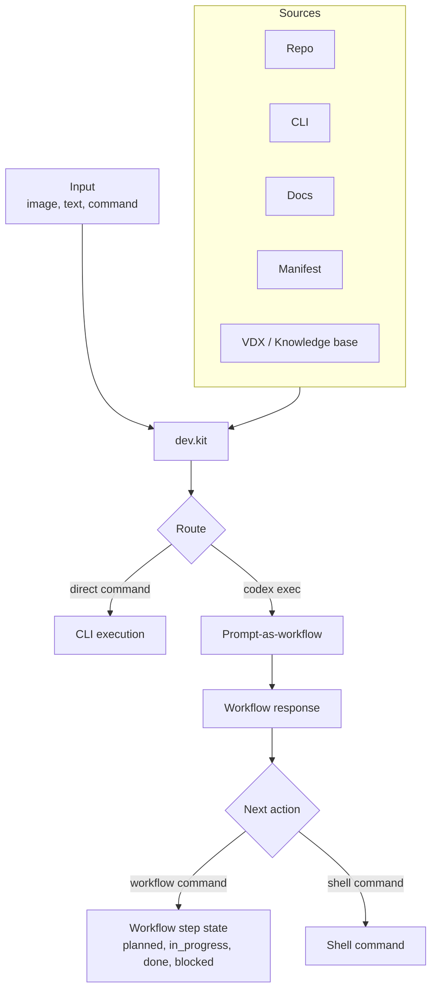

# dev.kit

Deterministic developer workflow kit for humans + AI. One CLI entrypoint, shared workflows/prompts under `src/` and `templates/`, and a stable contract for iteration.

## Install

Quick start (one-liner):
```
curl -fsSL https://raw.githubusercontent.com/udx/dev.kit/main/bin/scripts/install.sh | bash

# If the installer doesn't prompt for shell updates:
source "$HOME/.udx/dev.kit/source/env.sh"
```

## Use

- View commands: `dev.kit help`
- Show config: `dev.kit config show`
- Generate a prompt: `dev.kit prompt --request "..." --template ai.codex`
- Run exec (requires `ai.enabled = true`): `dev.kit exec "..."` or `dev.kit exec --print "..."` for dry-run.

## Docs

Start here:
- `docs/index.md` (root contract)

CLI and runtime:
- `docs/cli.md`
- `docs/runtime/index.md`
- `docs/runtime/layout.md`
- `docs/runtime/lifecycle.md`

Execution and iteration:
- `docs/execution/iteration-loop.md`
- `docs/execution/cli-primitives.md`
- `docs/execution/prompt-as-workflow.md`

Configuration:
- `docs/config/index.md`
- `docs/config/integrations.md`

Contracts and mappings:
- `docs/cde/index.md`
- `docs/mapping/index.md`

Prompts and templates:
- `docs/prompts.md`

## Repo Map (Core)

- `bin/` CLI entrypoints
- `lib/` runtime library code
- `src/` runtime source
- `config/` runtime configuration
- `docs/` specs and contracts
- `src/workflows/` workflow artifacts
- `templates/prompts/` iteration prompts
- `scripts/` helpers

## Prompt For Teammate AI
```
You are my teammate working on dev.kit. Goal: keep the workflow engine deterministic, predictable, and easy to run locally.
Start by reading `docs/index.md` and `docs/execution/iteration-loop.md`.
Core code lives in `bin/`, `lib/`, `src/`, and `config/`. Workflows and prompts live in `src/workflows/` and `templates/prompts/`.
Keep changes small and reversible. Prefer explicit CLI behavior over hidden side effects.
If unsure, ask before introducing new abstractions or reworking execution flow.
```

## Flow Mermaid


