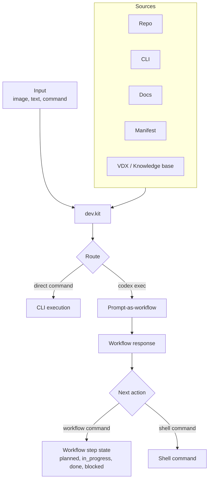

# dev.kit

Deterministic developer workflow kit for humans + AI. One CLI entrypoint, shared workflows/prompts under src/ and templates/, and a stable contract for iteration.

Quick start:
```
curl -fsSL https://raw.githubusercontent.com/udx/dev.kit/main/bin/scripts/install.sh | bash

dev.kit enable --shell=bash   # or --shell=zsh
```

Start here:
- `docs/index.md`
- `docs/execution/iteration-loop.md`
- `docs/execution/cli-primitives.md`

Repo map (core):
- `bin/` CLI entrypoints
- `lib/` runtime library code
- `src/` runtime source
- `config/` runtime configuration
- `docs/` specs and contracts
- `src/workflows/` workflow artifacts
- `templates/prompts/` iteration prompts
- `schemas/` workflow I/O schemas
- `scripts/` helpers

Prompt for teammate AI:
```
You are my teammate working on dev.kit. Goal: keep the workflow engine deterministic, predictable, and easy to run locally.
Start by reading `docs/index.md` and `docs/execution/iteration-loop.md`.
Core code lives in `bin/`, `lib/`, `src/`, and `config/`. Workflows and prompts live in `src/workflows/` and `templates/prompts/`.
Keep changes small and reversible. Prefer explicit CLI behavior over hidden side effects.
If unsure, ask before introducing new abstractions or reworking execution flow.
```

Flow Mermaid:


