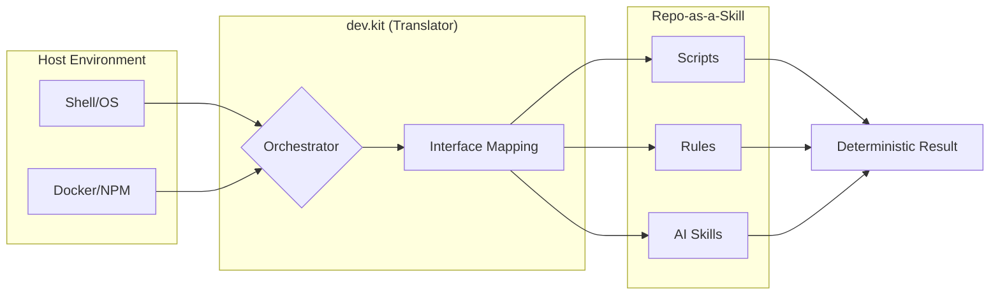
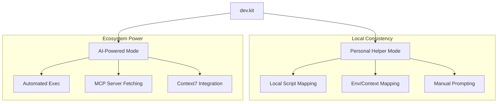

# dev.kit — Smart Engineering Interface Translator

**Experienced dev flow without bullshit.**

`dev.kit` is a deterministic developer workflow kit that translates your local environment, tools, and repository skills into a single, high-fidelity engineering interface for humans and AI.

---

## The Vision: Repo is a Skill

`dev.kit` stands between the messy reality of host environments and the need for deterministic execution. It maps your repository capabilities (`src/*`) and configurations (`environment.yaml`) into a stable CLI interface.


```mermaid
flowchart LR
    subgraph "Host Environment"
        A[Shell/OS]
        B[Docker/NPM]
    end
    
    subgraph "dev.kit (Translator)"
        C{Orchestrator}
        D[Interface Mapping]
    end
    
    subgraph "Repo-as-a-Skill"
        E[Scripts]
        F[Rules]
        G[AI Skills]
    end
    
    A & B --> C
    C --> D
    D --> E & F & G
    E & F & G --> H[Deterministic Result]
```

---

## Operating Modes

Choose your level of power. `dev.kit` works as a standalone helper or a fully integrated AI orchestrator.


```mermaid
graph TD
    Start[dev.kit] --> Personal[Personal Helper Mode]
    Start --> AI[AI-Powered Mode]
    
    subgraph "Local Consistency"
        Personal --> P1[Local Script Mapping]
        Personal --> P2[Env/Context Mapping]
        Personal --> P3[Manual Prompting]
    end
    
    subgraph "Ecosystem Power"
        AI --> A1[Automated Exec]
        AI --> A2[MCP Server Fetching]
        AI --> A3[Context7 Integration]
    end
```

---

## Core Toolset

*   **`dev.kit doctor`**: Autodetects engineering software (Shell, Docker, NPM, Gemini) and gives effectivity advice.
*   **`dev.kit audit`**: Validates repository compliance (TDD, 12-Factor, Active Context) for the **Repo-as-a-Skill** approach.
*   **`dev.kit task`**: Manages the iterative engineering loop from prompt to workflow.
*   **`dev.kit config`**: Orchestrates configurations across hosts using `environment.yaml`.

## Install

Quick start (one-liner):

```bash
curl -fsSL https://raw.githubusercontent.com/udx/dev.kit/main/bin/scripts/install.sh | bash
source "$HOME/.udx/dev.kit/source/env.sh"
```

## Documentation

Detailed guides and methodology are available in the `docs/` directory:

- **Methodology (CWA)**: `docs/concepts/methodology.md`
- **CLI Overview**: `docs/cli/overview.md`
- **AI Integration**: `docs/ai/README.md`
- **Reference**: `docs/reference/udx-reference-index.md`

---
*UDX DevSecOps Team*
