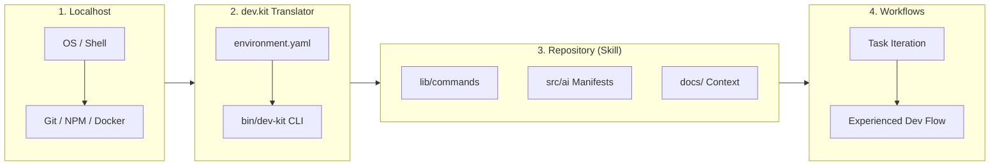
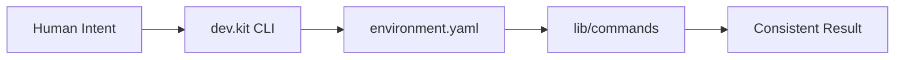
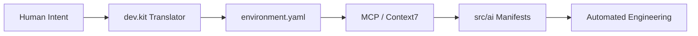

# dev.kit — Smart Engineering Interface Translator

**Experienced dev flow without bullshit.**

`dev.kit` is a deterministic developer workflow kit that translates your local environment, tools, and repository skills into a single, high-fidelity engineering interface for humans and AI.

---

## The Vision: Repo is a Skill

`dev.kit` translates the messy reality of host environments into high-fidelity engineering workflows.


```mermaid
flowchart LR
    subgraph Localhost ["1. Localhost"]
        direction TB
        OS[OS / Shell] --> TOOLS[Git / NPM / Docker]
    end

    subgraph Translator ["2. dev.kit Translator"]
        direction TB
        YML[environment.yaml] --> CLI[bin/dev-kit CLI]
    end

    subgraph Repo ["3. Repository (Skill)"]
        direction TB
        LIB[lib/commands]
        SRC[src/ai Manifests]
        DOC[docs/ Context]
    end

    subgraph Workflows ["4. Workflows"]
        direction TB
        TASK[Task Iteration] --> FLOW[Experienced Dev Flow]
    end

    Localhost --> Translator
    Translator --> Repo
    Repo --> Workflows
```

---

## Operating Modes

Choose your level of power. `dev.kit` works as a standalone helper or a fully integrated AI orchestrator.

### 1. Personal Helper Mode
**Consistent local automation without AI.**


```mermaid
flowchart LR
    User[Human Intent] --> CLI[dev.kit CLI]
    CLI --> MAP[environment.yaml]
    MAP --> CMD[lib/commands]
    CMD --> RES[Consistent Result]
```

### 2. AI-Powered Mode
**Deep automation with ecosystem and AI awareness.**


```mermaid
flowchart LR
    User[Human Intent] --> TR[dev.kit Translator]
    TR --> YML[environment.yaml]
    YML --> ECO[MCP / Context7]
    ECO --> MAN[src/ai Manifests]
    MAN --> AUTO[Automated Engineering]
```

---

## Core Toolset

- **`dev.kit doctor`**: Autodetects engineering software (Shell, Docker, NPM, Gemini) and gives effectivity advice.
- **`dev.kit audit`**: Validates repository compliance (TDD, 12-Factor, Active Context) for the **Repo-as-a-Skill** approach.
- **`dev.kit task`**: Manages the iterative engineering loop from prompt to workflow.
- **`dev.kit config`**: Orchestrates configurations across hosts using `environment.yaml`.

## Install

Quick start (one-liner):

```bash
curl -fsSL https://raw.githubusercontent.com/udx/dev.kit/main/bin/scripts/install.sh | bash
source "$HOME/.udx/dev.kit/source/env.sh"
```

## Documentation

Detailed guides and methodology are available in the `docs/` directory:

- **Methodology (CWA)**: `docs/concepts/methodology.md`
- **CLI Overview**: `docs/cli/overview.md`
- **AI Integration**: `docs/ai/README.md`
- **Reference**: `docs/reference/udx-reference-index.md`

---

_UDX DevSecOps Team_
