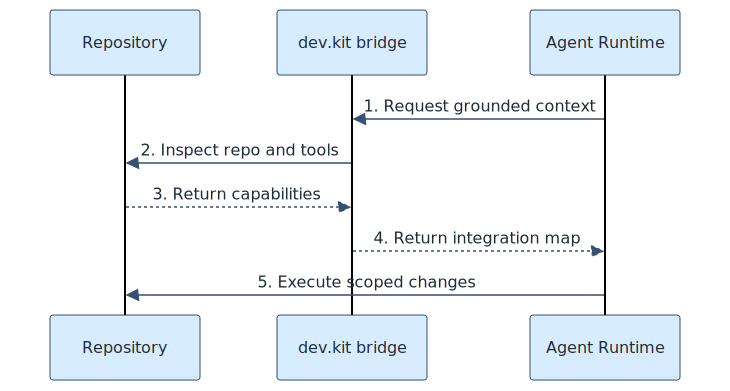

# dev.kit


`dev.kit` is a 12-factor repo adapter.

It scans a repository for the operational signals that make development easier and more consistent across a team: documentation, dependency contracts, config boundaries, verification entrypoints, runtime entrypoints, and build/release/run separation.

The goal is simple: standardize how repos are built, tested, run, and improved so humans and agents do not have to reinvent workflow on every project.

## Commands

`dev.kit`

- Audits the current repo against 12-factor workflow boundaries.
- Returns a short human-readable improvement plan by default.
- `--json` returns the same model in machine-readable form.

`dev.kit bridge`

- Exposes the repo model for agents.
- Returns detected profiles, factor statuses, entrypoints, and guidance so agents can work from grounded repo reality instead of guessing.





## Why It Fits Development

Run `dev.kit` when a repo is new, drifting, hard to onboard into, or inconsistent across environments.

As a repo gets closer to 12-factor structure, it becomes easier to:

- develop without tribal knowledge
- verify changes predictably
- automate build and runtime workflows
- let agents operate with less ambiguity

The value is not only compliance. The value is a normalized development workflow.

## Install

```bash
bash bin/scripts/install.sh
source "$HOME/.udx/dev.kit/bin/env/dev-kit.sh"
dev.kit
```

## Examples

```bash
dev.kit
dev.kit --json
dev.kit bridge --json
```

## Uninstall

```bash
"$HOME/.udx/dev.kit/bin/scripts/uninstall.sh"
```

Further docs:

- [Workflow](/Users/jonyfq/git/udx/dev.kit/docs/workflow.md)
- [Development](/Users/jonyfq/git/udx/dev.kit/docs/development.md)
