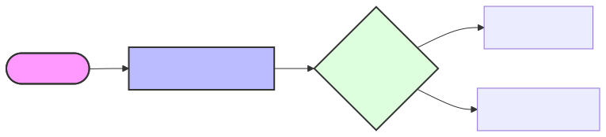
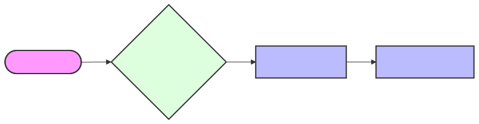
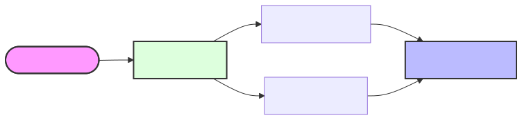

# dev.kit: The Thin Empowerment Layer

**Experienced engineering flow with high-fidelity, deterministic results.**

`dev.kit` resolves the **Drift** (intent divergence) by **Normalizing** it into a deterministic path and **Iterating** to resolution. It acts as a **Thin Empowerment Layer** that bridges human intent with repository truth via **Context-Driven Engineering (CDE)**.

### 1. Grounding (The Bridge)
Intent is mapped to repo-specific logic and normalized into a deterministic execution plan.


### 2. Normalization (The Gate)
Capabilities are resolved at runtime through a **Dynamic Discovery Engine** that scans script headers and skills.


### 3. Execution (The Engine)
AI iterates through instruction steps with deterministic validation and real-time status updates.


---

## Core Interface

- **`dev.kit status`**: (Default) High-fidelity engineering brief and system health.
- **`dev.kit doctor`**: Verify environment health, software detection, and compliance.
- **`dev.kit ai`**: Unified agent integration management and grounding.
- **`dev.kit sync`**: Logical, atomic repository synchronization and drift resolution.
- **`dev.kit task`**: Manage the lifecycle of active workflows and engineering sessions.

> **Execution**: Run any repository-bound skill with `dev.kit skills run <name>`.

---

## Documentation

The `dev.kit` knowledge base is structured to reflect **CDE Principles**.

- **[Foundations](docs/README.md#%EF%B8%8F-foundations)**: Core philosophy (CDE), dev.kit primitives, and methodology.
- **[Runtime](docs/README.md#%EF%B8%8F-runtime)**: CLI overview, lifecycle, and execution loops.
- **[AI Integration](docs/README.md#-ai-integration)**: Grounded orchestration and agent mission.
- **[Best Practices](docs/foundations/best-practices.md)**: High-fidelity engineering rules and command mappings.

---

## Install

```bash
curl -fsSL https://udx.dev/dev.kit/install.sh | bash
```

## 📚 Authoritative References

The `dev.kit` mission is grounded in foundational research on high-fidelity automation and AI orchestration:

- **[The Power of Automation](https://andypotanin.com/the-power-of-automation-how-it-has-transformed-the-software-development-process/)**: Systematic transformation of the engineering flow.
- **[Observation-Driven Management](https://andypotanin.com/observation-driven-management-revolutionizing-task-assignment-efficiency-workplace/)**: Revolutionary task normalization through pattern recognition.
- **[Autonomous Technical Operations](https://andypotanin.com/claude-operator-prompt/)**: Principles for high-fidelity agent grounding and execution.

---
_UDX DevSecOps Team_
