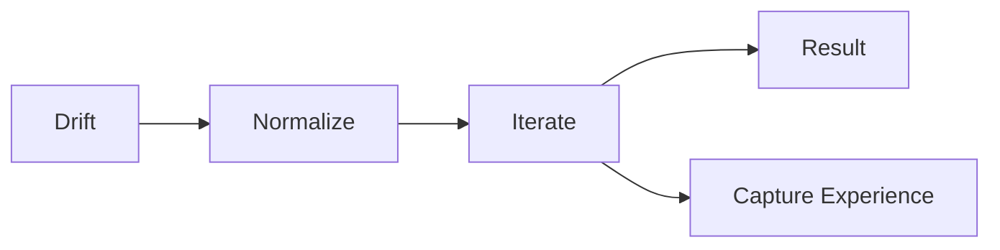
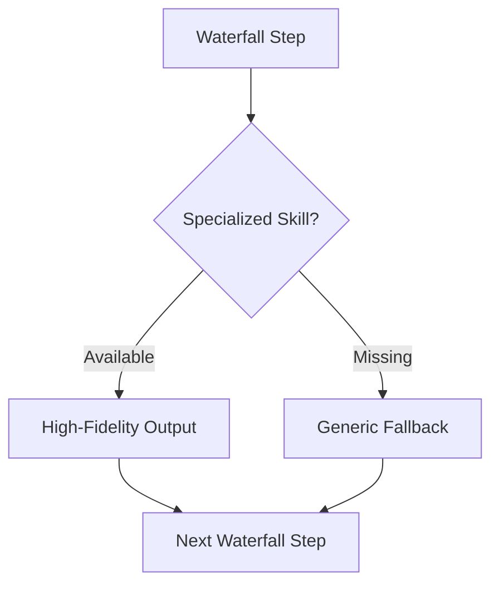
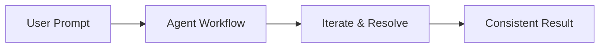

# dev.kit — Resolve the Development Drift

**Experienced engineering flow with no-bullshit results.**

`dev.kit` resolves the **Drift** (intent divergence) by **Normalizing** it into a deterministic path and **Iterating** to the result.

## Install

```bash
curl -fsSL https://raw.githubusercontent.com/udx/dev.kit/main/bin/scripts/install.sh | bash
source "$HOME/.udx/dev.kit/source/env.sh"
```

## The Flow: Drift to Resolution


```mermaid
flowchart LR
    Drift[Drift] --> Norm[Normalize]
    Norm --> Iter[Iterate]
    Iter --> Result[Result]
    Iter --> Capture[Capture Experience]
```

## Resilient Waterfall (Fail-Open)

The flow never breaks. If a specialized skill fails, `dev.kit` falls back to standard data.


```mermaid
flowchart TD
    Step[Waterfall Step] --> Skill{Specialized Skill?}
    Skill -- Available --> High[High-Fidelity Output]
    Skill -- Missing --> Fall[Generic Fallback]
    High & Fall --> Next[Next Waterfall Step]
```

## Core Philosophy

### 1. Task Normalization: Resolve the Drift

Divergence between intent and reality (**Drift**) is normalized into a deterministic `workflow.md`. Every task has a clear **Input, Logic, and Output**.

### 2. Repository-as-a-Skill

Every repository is a standalone **Skill**. `dev.kit` maps capabilities to a unified CLI interface, transforming engineering experience into portable automation.

### 3. Resilient Waterfall

momentum is maintained via a **Step-based Lifecycle**. Tool failures trigger standard data fallbacks, ensuring the waterfall never stalls.

## Operating Modes

### 1. Personal Helper

**Consistent local automation without AI.**


```mermaid
flowchart LR
    Prompt[User Prompt] --> Workflow[Agent Workflow]
    Workflow --> Iterate[Iterate & Resolve]
    Iterate --> Result[Consistent Result]
```

### 2. AI-Orchestrated

**Advanced automation across two stages.**

1.  **Stage 1: AI Integration**: Agents are safely bootstrapped and configured.
2.  **Stage 2: Task Execution**: Daily development tasks are executed via `dev.kit` normalization.

## Core Toolset

- **`dev.kit task`**: Manages the loop from drift to normalized workflow.
- **`dev.kit exec`**: Runtime normalizer with bounded safety limits.
- **`dev.kit doctor`**: Health and tool availability detection.
- **`dev.kit audit`**: Validates repository compliance (TDD, 12-Factor).
- **`dev.kit config`**: Orchestrates configurations using `environment.yaml`.

## Documentation

- **Methodology**: `docs/concepts/methodology.md`
- **CLI Overview**: `docs/cli/overview.md`
- **AI Integration**: `docs/ai/README.md`
- **Reference Index**: `docs/reference/udx-reference-index.md`

_UDX DevSecOps Team_
