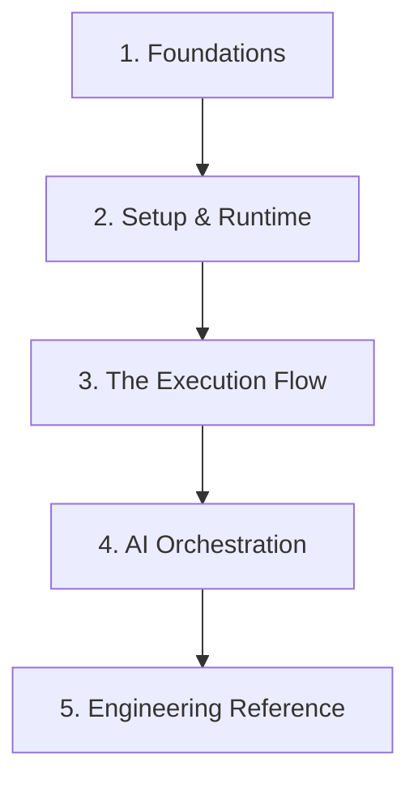

# dev.kit Documentation Index

Welcome to the **Smart Helper** documentation. This guide is structured to help you resolve the **Development Drift** from foundations to execution.

---

### 1. Foundations
Understand the core engineering model behind dev.kit.
- **Methodology (CWA)**: `docs/concepts/methodology.md` - CLI-Wrapped Automation.
- **Context Driven Engineering (CDE)**: `docs/concepts/cde.md` - Resolving the Drift.
- **Context Adaptation**: `docs/concepts/adaptation.md` - Resilient Projections.
- **Principles**: `docs/reference/principles.md` - Engineering guardrails.

### 2. Setup & Runtime
Configure your environment and understand the CLI surface.
- **Installation**: `README.md#install` - Quick start one-liner.
- **CLI Overview**: `docs/cli/overview.md` - Commands and wiring.
- **Configuration**: `docs/cli/config.md` - Using `environment.yaml`.
- **Runtime Lifecycle**: `docs/cli/runtime/lifecycle.md` - How dev.kit starts and stops.

### 3. The Execution Flow
Master the task normalization engine and deterministic workflows.
- **Execution Index**: `docs/cli/execution/index.md` - Flow entry point.
- **Task Normalization**: `docs/cli/execution/iteration-loop.md` - Drift to Result.
- **Workflow Schema (DOC-003)**: `docs/cli/execution/workflow-io-schema.md` - Bounded work contracts.
- **Prompt-as-Workflow**: `docs/cli/execution/prompt-as-workflow.md` - Intent to Execution.

### 4. AI Orchestration
Leverage AI agents to automate the waterfall.
- **AI Integration**: `docs/ai/README.md` - Setup and integration index.
- **User Experience**: `docs/ai/experience.md` - Prompting and execution modes.
- **Skill Packs**: `src/ai/data/skill-packs/` - Repository-as-a-Skill implementations.

### 5. Engineering Reference
Standards and guidance for high-fidelity engineering.
- **Reference Index**: `docs/reference/udx-reference-index.md` - Map of all references.
- **12-Factor App**: `docs/reference/12-factor.md` - Configuration and state.
- **Compliance & Security**: `docs/reference/cato-overview.md` - Continuous Authorization.

---
_UDX DevSecOps Team_
