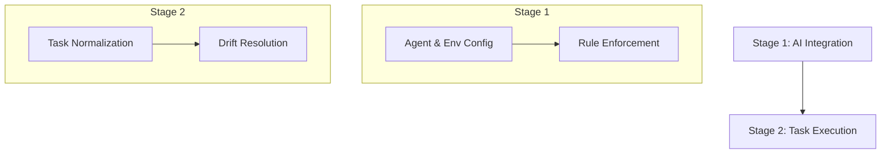

# AI Orchestration: Smart Helper & Agent Logic

Domain: AI

## Summary

AI Orchestration in **dev.kit** is a two-stage process for resolving **Drift** through a high-fidelity engineering interface. It transforms your repository into a standalone **Skill**.

## The Two-Stage Process

### Stage 1: AI Integration (Hydration)
- **Agent Bootstrapping**: Sync repository memories and skills via `dev.kit agent <gemini|codex>`.
- **Standardized Mappings**: Skills in `src/ai/data/skills/` define keywords and usage for automated agent discovery.
- **Dynamic Hooks**: Gemini integration includes `pre_command` (health check) and `post_command` (log capture) hooks.

### Stage 2: Task Execution & Interactive Gates
- **Normalization Gate**: Agents must **STOP and ASK** if intent is ambiguous or matching confidence is low.
- **Workflow Loops**: Standardized loops (`feature`, `bugfix`, `doc-sync`) defined in `src/ai/data/workflows.json` provide a deterministic roadmap.
- **Context Persistence**: Every session update is captured into the repository's Knowledge Layer.

## Core Components

- **Engineering Scenarios**: `docs/scenarios/README.md` - Lifecycle examples and demo flows.
- **Skill Packs**: `src/ai/data/skill-packs/` - High-fidelity skill implementations.
- **CLI Overview**: `docs/cli/overview.md` - Command surface and dispatch logic.

---
_UDX DevSecOps Team_
