# AI Orchestration: The Configuration Mechanism

Domain: AI

## Summary

AI Orchestration in **dev.kit** treats the AI agent as a **Configuration Mechanism**. Instead of simple chat, the agent acts as a bridge between high-level user intent and deterministic repository-based skills.

## The Intent-to-Action Flow

### 1. Intent Capture & Skill Discovery
When a user prompts a task (e.g., "Deploy as docker container"), the agent looks up "Experienced Skills" defined in the repository or available via remote MCP servers.

### 2. Normalization Layer
`dev.kit` enforces prompt normalization. It maps the discovered skills to the specific repository context, ensuring the AI's instructions are grounded in the actual environment.

### 3. Iterative Resolution (The Loop)
The AI doesn't just provide an answer; it iterates through instruction steps or loops through feedback cycles. This ensures that even complex "Drift" is resolved step-by-step with deterministic validation.

### 4. Workflow Generation
The final output is a set of **Workflow Steps** (commands and options) that can be executed directly by the `dev.kit` runtime.

## Core Components

- **Engineering Scenarios**: `docs/scenarios/README.md` - Lifecycle examples and demo flows.
- **Skill Packs**: `src/ai/data/skill-packs/` - High-fidelity skill implementations.
- **Experience Layer**: `docs/ai/experience.md` - Interaction modes and persistence.
- **CLI Overview**: `docs/cli/overview.md` - Command surface and dispatch logic.

---
_UDX DevSecOps Team_
