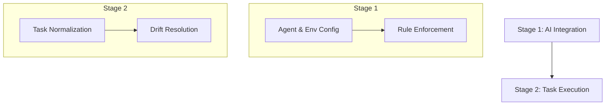

# AI Orchestration: Smart Helper & Agent Logic

Domain: AI

## Summary

AI Orchestration in **dev.kit** is not just about "prompting." It's a two-stage process for resolving **Drift** through a high-fidelity engineering interface.

## The Two-Stage Process

### Stage 1: AI Integration & Environment Config
- **Agent Bootstrapping**: Configuration settings in `environment.yaml` ensure agents are safely initialized.
- **Rule Enforcement**: `dev.kit` uses repository-scoped rules to constrain agent behavior and ensure high-fidelity results.
- **Key Doc**: `docs/ai/integrations.md`.

### Stage 2: Task Execution via Normalization
- **Task Normalization**: Chaotic prompts are transformed into deterministic `workflow.md` (DOC-003) artifacts.
- **Agent Power**: Agents leverage `dev.kit exec` to run repository "Skills" without hallucinating logic or bypassing CLI boundaries.
- **Key Doc**: `docs/ai/experience.md`.

## Core Components

- **User Experience**: `docs/ai/experience.md` - Prompting and execution modes.
- **Skill Packs**: `src/ai/data/skill-packs/` - The repository's "Skills" available to agents.
- **Prompt System**: `docs/ai/prompts.md` - Templates and routing logic.

---
_UDX DevSecOps Team_
