# AI Integration Experience: High-Fidelity Interaction

Domain: AI

## Purpose

The AI Integration Experience ensures that both humans and agents have a consistent, deterministic way to interact with the repository's skills. It supports multiple execution modes, transforming the AI from a chat bot into a **Configuration Mechanism**.

## The Interaction Design

1.  **Intent Capture**: Human or agent provides a high-level task description.
2.  **Normalization Layer**: `dev.kit` transforms this intent into a deterministic prompt artifact.
3.  **Execution Mode**: The prompt is either handled by a local engine (`gemini`, `codex`) or printed for manual use.
4.  **Feedback Capture**: The result and execution context are captured back into the repository's knowledge layer.

## Operating Modes

### Mode A: AI-Powered (Local Configuration Engine)
**Requirements**: `ai.enabled = true`, supported CLI engine installed.
- **Behavior**: `dev.kit skills run` automatically generates the prompt and runs the AI engine.
- **Outcome**: The AI acts as a smart configuration tool, producing executable changes or plans immediately.
- **Persistence**: Results are automatically captured in `~/.udx/dev.kit/state/`.

### Mode B: Human-Assisted (Interface Bridge)
**Requirements**: `ai.enabled = false` (Default).
- **Behavior**: `dev.kit skills run` generates and prints the normalized prompt to the terminal.
- **Usage**: Copy-paste into any web UI (ChatGPT, Claude) or local LLM.
- **Outcome**: `dev.kit` provides the *configuration context* needed for any AI to understand the repository's skills.

## Context & Continuity

`dev.kit` maintains repository-scoped memory to ensure momentum across multi-turn interactions.

- **Continuity Signals**: Injected into every prompt to tell the AI:
    - **Where it is**: Current active workflow path.
    - **What it's doing**: Current step ID.
    - **What happened**: Previous step status and missing inputs.

- **Memory Management**:
    - `dev.kit task show`: Inspect the active memory.
    - `dev.kit task reset`: Clear the memory to start fresh.
    - `dev.kit skills run --no-context`: Run a one-off task without history.

---
_UDX DevSecOps Team_
