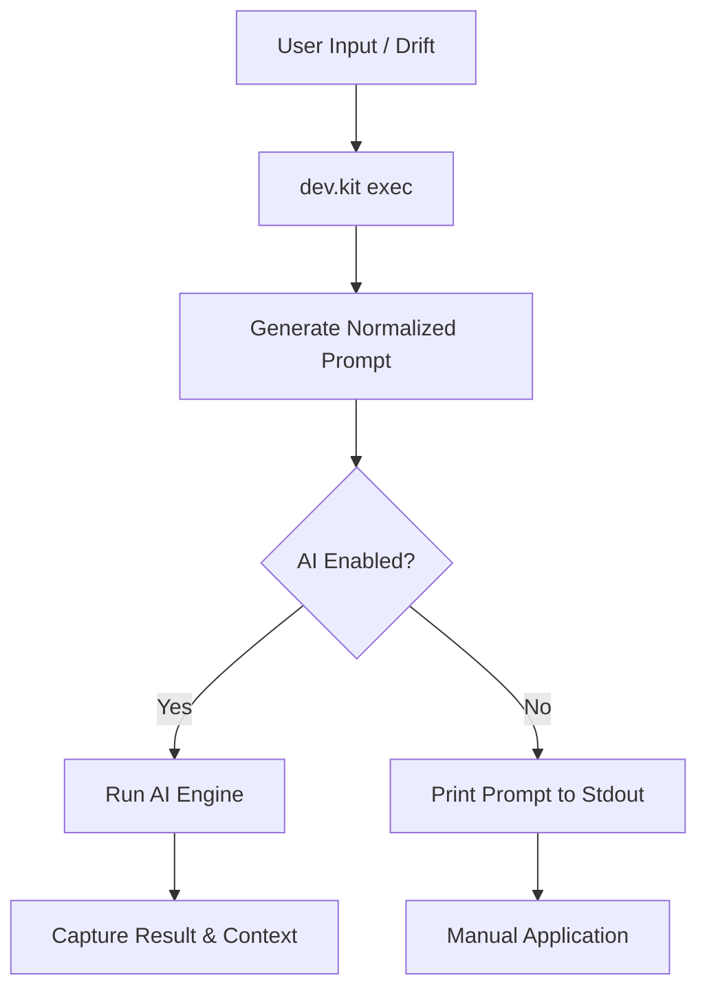

# AI Integration Experience: High-Fidelity Prompting

Domain: AI

## Purpose

The AI Integration Experience ensures that both humans and agents have a consistent, deterministic way to interact with the repository's skills. It supports multiple execution modes depending on tool availability.

## The Execution Flow

## Operating Modes

### Mode A: AI-Powered (Smart Translator)
**Requirements**: `ai.enabled = true`, supported CLI (e.g., `codex`, `gemini`) installed.
- **Behavior**: `dev.kit exec` automatically generates the prompt and runs the AI engine.
- **Persistence**: Results and context are automatically captured in the repository-scoped context.

### Mode B: Personal Helper (Interface Translator)
**Requirements**: `ai.enabled = false` (Default).
- **Behavior**: `dev.kit exec` generates and prints the normalized prompt to the terminal.
- **Usage**: Copy the output into a web UI (ChatGPT, Claude), local LLM, or a manual session.

## Context & Persistence

**dev.kit** maintains a repository-scoped memory to ensure continuity across multiple turns.
- **Config**: `context.enabled = true`, `context.max_bytes = 4000`.
- **Commands**:
    - `dev.kit context show`: Inspect the current memory.
    - `dev.kit context reset`: Clear the memory.
    - `dev.kit exec --no-context`: Run a one-off command without context.

## Skill Adaptation

To ensure AI agents can use repository skills, `dev.kit` projects internal skill definitions into tool-specific manifests (Stage 1 AI Orchestration).
- **Command**: `dev.kit codex config all --apply` - Syncs local skills to the agent's environment.
- **Managed Skills**: These appear as `dev-kit-*` skills in the agent's toolbelt.

## Continuity Signals

For multi-turn tasks, dev.kit injects **Continuity Signals** into every prompt:
- **Active Workflow Path**: The path to the current `workflow.md`.
- **Current Step ID**: The specific task the agent is working on.
- **Resumption Context**: Any missing inputs or blocked statuses from the previous turn.

---
_UDX DevSecOps Team_
