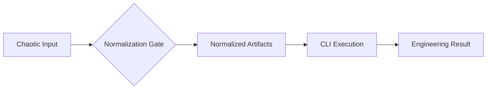

# The Execution Flow: From Drift to Resolution

Domain: Execution

## Purpose

The Execution Flow is the core process dev.kit uses to resolve **Drift** (intent divergence) through **Task Normalization**. It uses the CLI as an execution wrapper and reasoning systems for deterministic planning.

## The Normalization Gate

To ensure consistent results, every chaotic input must pass through the **Normalization Gate**.

1.  **Input**: The raw human or agent request.
2.  **Normalize**: Transform request into a `workflow.md` (DOC-003).
3.  **Execute**: Run the bounded steps through the CLI boundary.
4.  **Result**: Achieve the desired high-fidelity state.

## Core Documents

- **Iteration Loop**: `docs/cli/execution/iteration-loop.md` - The planning/execution cycle.
- **Workflow Schema (DOC-003)**: `docs/cli/execution/workflow-io-schema.md` - The bounded work contract.
- **Prompt-as-Workflow**: `docs/cli/execution/prompt-as-workflow.md` - Turning intent into a sequence of steps.

## The Extraction Gate

When a step becomes too complex, it must be extracted into a **Child Workflow**. Use the following criteria (if 2+ are yes, extract):
1.  Requires multiple sub-steps or tools.
2.  Is reusable across projects or domains.
3.  Changes multiple files or crosses domain boundaries.
4.  Requires its own plan, verification, or fallback logic.
5.  Depends on external state (network, system config).

## Execution Boundaries

- **Reasoning vs. Runtime**: Reasoning systems (Agents) propose steps; the `dev.kit` runtime executes them.
- **Fail-Open Normalization**: Environment failures trigger a fallback to **Standard Data**, ensuring the sequence is never blocked.
- **Bounded Safety**: Every step is independently bounded to prevent runaway execution.

---
_UDX DevSecOps Team_
