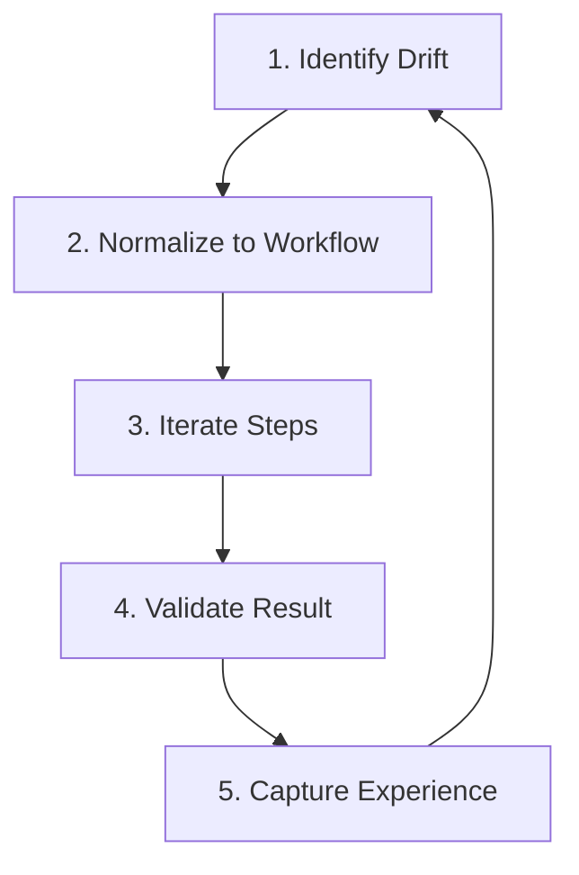

# Iteration Loop: Resolving the Drift

Domain: Execution

## Purpose

The Iteration Loop is the practical mechanism dev.kit uses to resolve the **Drift** between human intent and the repository's current state. It defines a deterministic cycle of planning, execution, and validation.

## The Drift Resolution Cycle

1.  **Identify Drift**: Capture the gap between intent and current state (Prompt/Request).
2.  **Normalize**: Convert the drift into a deterministic `workflow.md` (Task Apply).
3.  **Iterate**: Execute the bounded steps (Exec/Codex).
4.  **Validate**: Verify the result against the original intent (Doctor/Audit).
5.  **Capture**: Package the resolution logic into repository skills for future use.

## Core Artifacts

- **Input**: `tasks/<task-id>/prompt.md` - The intent.
- **Plan**: `tasks/<task-id>/workflow.md` - The normalized steps.
- **Feedback**: `tasks/<task-id>/feedback.md` - The execution log.
- **State**: `~/.udx/dev.kit/state/` - The runtime context.

## Session Continuity

To maintain momentum across multiple AI turns, the following signals must be preserved:
- **Active Workflow**: The path to the current `workflow.md`.
- **Step Status**: `planned | in_progress | done | blocked`.
- **Open Questions**: Explicitly list missing inputs or blocks.
- **Next Action**: The specific CLI command or user input required to proceed.

## Boundaries & Guardrails

- **Reasoning vs. Execution**: AI agents produce artifacts (Workflows/Prompts); the CLI runtime executes them.
- **No Hidden Side Effects**: Every change must be declared in a workflow step.
- **Deterministic Paths**: If a tool fails, use the **Fail-Open** fallback to ensure the loop continues.
- **Validation First**: Every iteration must conclude with an explicit validation step.

## Resolution Rules

A task is considered **Resolved** when:
1. All workflow steps are marked `done`.
2. The `feedback.md` contains the final engineering result.
3. Repository health is verified via `dev.kit doctor`.

---
_UDX DevSecOps Team_
