# Context Adaptation: Resilient Projections

Domain: Concepts

## Summary

**Adaptation** describes how dev.kit projects shared repository sources into tool-specific formats without losing the canonical intent. It is the technical bridge for **Resilient Normalization**.

## The Purpose of Adaptation

- **Normalize Interfaces**: Projecting repository "Skills" into machine-consumable formats (e.g., JSON schemas for Codex or Gemini).
- **Resilient Fallback**: Ensuring that if a tool-specific format fails, we can project back to a **Standard Data** (e.g., Markdown) format.
- **Maintain Canonical Intent**: Ensuring the "Drift" is resolved at the repository level, not the tool level.

## Boundaries and Rules

- **Canonical First**: Always resolve the drift in the repository's source artifacts.
- **Reversibility**: Adaptation should be a projection, not a transformation. It should be possible to regenerate tool formats from the source.
- **Fail-Open**: If an adaptation fails (e.g., missing tool), fall back to a generic output format to ensure the waterfall sequence continues.

## Practical Examples

- **Skill Rendering**: Converting `src/ai/data/skills/` into `~/.codex/skills/` manifests.
- **SVG Export**: Projecting `.mmd` files into `.svg` (or falling back to the raw source when `mmdc` is missing).
- **Environment Mapping**: Translating `environment.yaml` into host-specific environment variables and shell aliases.

---
_UDX DevSecOps Team_
