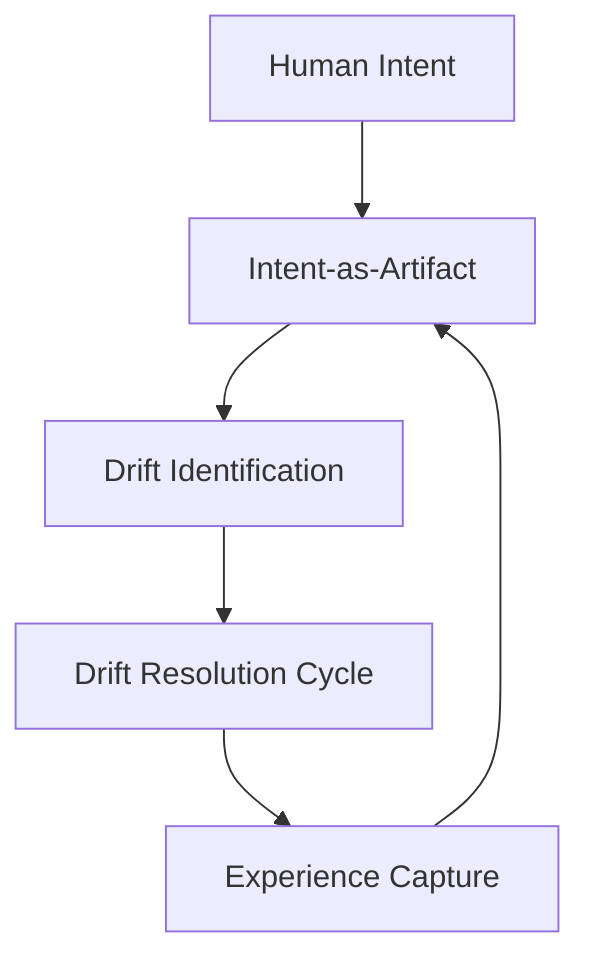

# Context Driven Engineering (CDE): Resolving the Drift

Domain: Concepts

## Summary

**Context Driven Engineering (CDE)** is the model dev.kit uses to turn chaotic intent into executable context. It provides a structural framework for identifying and **Resolving the Drift** between intent and reality.

## Core Philosophy

- **Intent-as-Artifact**: Intent is expressed as concrete, versioned artifacts (docs, prompts, schemas).
- **Drift Identification**: By comparing the current state against these artifacts, dev.kit identifies the "Drift."
- **Normalization Boundary**: Drift is resolved through a validated CLI boundary, ensuring every task is deterministic and reproducible.

## Artifacts (The Source of Truth)

- **Prompt Templates**: `src/ai/data/prompts.json` - How we talk to agents.
- **Skills and Schemas**: `src/ai/data/skills/` - The capabilities of the repository.
- **Workflow Schema (DOC-003)**: `docs/cli/execution/workflow-io-schema.md` - The contract for task execution.
- **CLI Primitives**: `docs/cli/execution/cli-primitives.md` - The building blocks of automation.

## The Drift Resolution Lifecycle

CDE maps the development waterfall into a resilient loop:
1. **Analyze**: Identify the drift from the user's intent.
2. **Normalize**: Map the drift to a deterministic `workflow.md`.
3. **Iterate**: Execute the workflow steps within the repository boundary.
4. **Post-Validate**: Ensure the drift has been resolved.
5. **Capture**: Package the engineering experience back into the repository skills.

## Output Contracts

Outputs follow strict normalization rules:
- `prompt`: Execution-ready for AI agents.
- `markdown`: Human-readable narrative for documentation and feedback.

---
_UDX DevSecOps Team_
