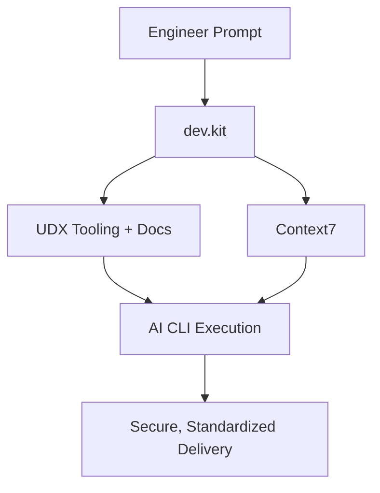
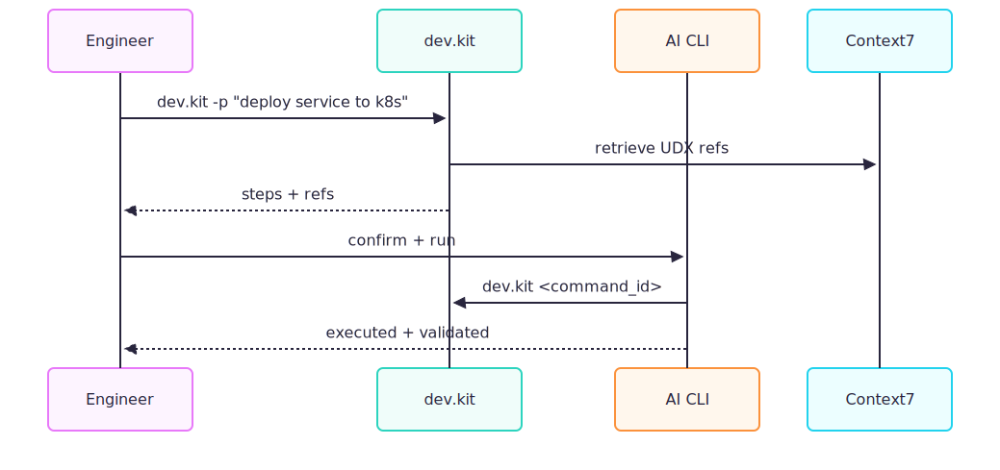
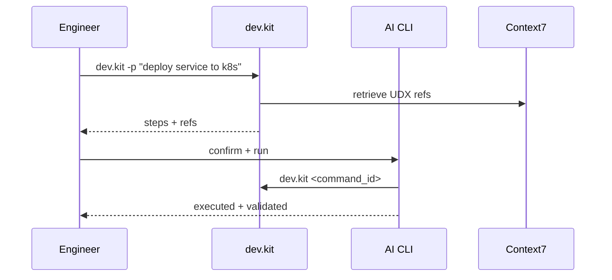

DevSecOps Enablement Demo (UDX)

Purpose
- Empower a small, senior team to move faster with consistent, secure workflows.
- Centralize knowledge + tooling with dev.kit as the primary interface.
- Leverage AI CLI + Context7 for fast, reliable execution and retrieval.

Core Capabilities
- dev.kit CLI: single entrypoint for UDX knowledge, tooling, and workflows.
- AI CLI (Codex/Claude): faster than IDE agents for multi-step tasks and shell-heavy work.
- Context7: shared, searchable docs for all UDX tooling repos.
- CDE-aligned repos: consistent metadata, examples, manifests, and config guides.

Why This Works
- Speed: fewer hops, faster access to “the right way” to do things.
- Standardization: one workflow contract across repos and tools.
- Safety: built-in previews and protected actions for risky operations.
- Leverage: senior experience + AI to reduce team size without losing velocity.

Development Flow (High-Level)

Mermaid

Workflow Example

Mermaid

Repo Expectations (CDE + Metadata)
- Every repo includes clear docs for usage, config, security, and ops.
- Examples/manifests are complete and runnable.
- Metadata is present for dev.kit + Context7 indexing.

Outcome
- One standard, auditable workflow across all UDX tooling.
- Faster onboarding and fewer context switches.
- Reliable, secure delivery with small, elite teams.

Phases:

1. dev.kit (CLI) for UDX team empowerment
  internal tooling and docs easy utilization
  - AI CLI (Codex/Claude) 
2. Establish dev.kit public (Easy Step)
3. Design Private Advanced API (Monetization) 