# Context-Driven Engineering (CDE): Resolving the Drift

**Domain:** Foundations / Core Philosophy  
**Status:** Canonical

## Summary

**Context-Driven Engineering (CDE)** is the foundational methodology of **dev.kit**. It transforms chaotic user intent into executable context by treating the repository as the **Single Source of Truth**. CDE provides the structural framework for identifying and **Resolving the Drift** between intent and reality.

---

## Core Principles: The Operational DNA

These principles guide every architectural decision in the `dev.kit` ecosystem:

1.  **Resolve the Drift**: Every action must purposefully close the gap between intent and repository state.
2.  **Deterministic Normalization**: Distill chaotic inputs into bounded, repeatable workflows before execution.
3.  **Resilient Waterfall (Fail-Open)**: Never break the flow. Fallback to **Standard Data** (raw logs/text) if specialized tools fail.
4.  **Repo-Scoped Truth**: The repository is the absolute, versioned source of truth for all skills and state. No "shadow logic."
5.  **Validated CLI Boundary**: All execution occurs through a hardened CLI interface for explicit confirmation and auditability.
6.  **Native-First Dependencies**: Favor standard POSIX-compliant tools (Bash, Git, `jq`) for maximum portability.
7.  **Symmetry of Artifacts**: Every output must be equally legible to humans (Markdown) and consumable by machines (YAML/JSON).

---

## The CDE Strategy: The Clean Repository

CDE avoids proprietary AI schemas, enforcing high-fidelity standards on traditional engineering artifacts:

- **Intent-as-Artifact**: Documentation is the **Specification**. Markdown is structured as logic for LLMs and guidance for humans.
- **Drift Identification**: `dev.kit` compares the current state against the documented "Target State" to identify the **Drift**.
- **Normalization Boundary**: Drift is identified through dynamic reasoning (**AI Skills**) and resolved through standard **Deterministic Primitives** (CLI commands). This ensures that while the reasoning is flexible, every execution step remains predictable and reproducible.

| Artifact Type     | Standard             | Purpose                                                                   |
| :---------------- | :------------------- | :------------------------------------------------------------------------ |
| **Documentation** | `Markdown (.md)`     | The "Logical Map." Defines intent and success criteria.                   |
| **Manifests**     | `YAML (.yaml)`       | Configuration-as-Code. Defines environments and dependencies.             |
| **Execution**     | `Scripts (.sh, .py)` | The "Engine." Provides the atomic actions to reach the target state.      |

---

## The Drift Resolution Lifecycle

CDE replaces "Black Box" generation with a **Resilient Engineering Loop**:

1.  **Analyze**: Audit the repo to identify the "Drift" from user intent.
2.  **Normalize**: Map the drift to a standard `workflow.md` execution plan.
3.  **Iterate**: Execute workflow steps using validated CLI scripts.
4.  **Validate**: Ensure the drift is resolved against the documentation.
5.  **Capture**: Check new logic back into the repo as standard source code or docs.

---

## The "Definition of Done" Checklist

Before a task is considered resolved, verify:

- [ ] Was the intent successfully normalized into a `workflow.md`?
- [ ] Did the execution path survive potential tool failures (**Fail-Open**)?
- [ ] Is the resulting logic captured as a reusable, repo-native **Skill**?
- [ ] Is the final state documented in Markdown for the next iteration?
## 🏗 Principle Grounding

Context-Driven Engineering is operationalized through canonical UDX resources:

| CDE Principle | Grounding Resource | Role |
| :--- | :--- | :--- |
| **Resolve the Drift** | [`udx/dev.kit`](https://github.com/udx/dev.kit) | The primary engine for intent resolution. |
| **Deterministic Base** | [`udx/worker`](https://github.com/udx/worker) | Hardened environment for context stability. |
| **Atomic Flow** | [`udx/reusable-workflows`](https://github.com/udx/reusable-workflows) | Pattern baseline for normalized execution. |

---

## 📚 Authoritative References

The principles of CDE are grounded in foundational research on automation and AI-driven management:

- **[AI-Powered Revolution in Content Management](https://andypotanin.com/ai-powered-revolution-content-management-synthetic-enrichment-standalone-quality/)**: High-fidelity synthetic enrichment and standalone quality.
- **[The Power of Automation](https://andypotanin.com/the-power-of-automation-how-it-has-transformed-the-software-development-process/)**: How automation transforms the software development lifecycle.
- **[Observation-Driven Management (ODM)](https://andypotanin.com/observation-driven-management-revolutionizing-task-assignment-efficiency-workplace/)**: Revolutionizing efficiency through AI-identified patterns.
- **[Implementing a cATO System](https://andypotanin.com/implementing-a-continuous-authority-to-operate-cato-system/)**: Principles for continuous authorization through automated evidence.
- **[SDLC Breaking Points](https://andypotanin.com/wordpress-risks/)**: Identifying common failure points in the development lifecycle.

---
_UDX DevSecOps Team_

