# Engineering Layers: The dev.kit Hierarchy

**Domain:** Reference / Structural Model  
**Status:** Canonical

## Summary

The Engineering Layers provide a structural model for categorizing repository "Skills," rules, and automation logic. Each layer builds upon the previous to resolve drift and maintain a high-fidelity environment. This hierarchy ensures that **Context-Driven Engineering (CDE)** remains grounded in standard source code, YAML, and Markdown.

---

## Layer 1: Source & Build (The Foundation)

**Scope:** Structural integrity, deterministic builds, and code-level validation.

- **Goal:** Establish a baseline of truth. If the foundation is "noisy," the AI cannot reason.
- **Core Artifacts:** Standard Source Code, Unit Tests, Linters, and Build Scripts.
- **Key Standards**: 
  - `docs/reference/standards/yaml-standards.md`
  - `docs/foundations/cde.md`

- **Capability:** The repository is "Build-Ready."

## Layer 2: Deployment & Runtime (The Workflow)

**Scope:** Environment parity, configuration-as-code, and the operational lifecycle.

- **Goal:** Maintain 12-Factor parity. Ensure that "Intent" can be deployed across any environment without friction.
- **Core Artifacts:** `environment.yaml`, `.env` templates, and deployment pipelines.
- **Key Standards**: 
  - `docs/reference/standards/12-factor.md`
  - `docs/reference/operations/lifecycle-cheatsheet.md`
- **Capability:** The repository is "Environment-Aware."

## Layer 3: Active Context & Orchestration (The Resolution)

**Scope:** Task normalization, bounded workflows, and autonomous drift resolution.

- **Goal:** Bridge the gap between human intent and repository execution. This layer uses standard Markdown and YAML to guide AI agents and CLI engines through complex tasks.
- **Core Artifacts:** `workflow.md` (the execution plan) and the `dev.kit` CLI engine.
- **Key Standards**: 
  - `docs/foundations/cde.md`
  - `docs/runtime/execution-loop.md`
- **Capability:** The repository is "Goal-Oriented" (Autonomous).

---

## The Dependency Chain

| Layer  | Input    | Output             | Result          |
| :----- | :------- | :----------------- | :-------------- |
| **L1** | Raw Code | Validated Artifact | **Stability**   |
| **L2** | Artifact | Running Process    | **Portability** |
| **L3** | Intent   | Resolved Drift     | **Flow**        |

## 📚 Authoritative References

Tiered engineering layers are aligned with modern infrastructure and software evolution:

- **[Tracing Software Evolution](https://andypotanin.com/digital-rails-and-logistics/)**: Drawing parallels between automotive innovation and tiered software algorithms.
- **[Modern Gateway Construction](https://andypotanin.com/sftp-in-cloud/)**: Building high-fidelity bridges for cloud-native development.

---
_UDX DevSecOps Team_
