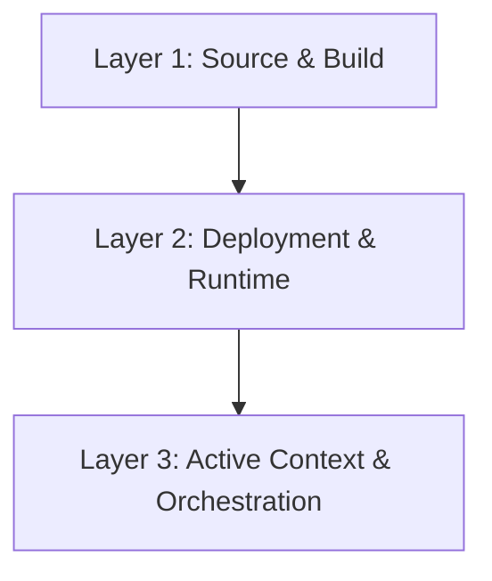

# Engineering Layers: The dev.kit Hierarchy

Domain: Reference

## Summary

The Engineering Layers provide a structural model for categorizing repository "Skills," rules, and automation logic. Each layer builds upon the next to resolve drift and maintain a high-fidelity environment.

## Layer 1: Source & Build (The Foundation)
**Scope**: How source code is structured, built, and validated.
- **Goal**: Establish a deterministic codebase.
- **Skills**: Linting, testing, dependency management, and build scripts.
- **Key Docs**: `docs/reference/yaml-standards.md`, `docs/reference/principles.md`.

## Layer 2: Deployment & Runtime (The Workflow)
**Scope**: Configuration, environment parity, process models, and logging.
- **Goal**: Maintain 12-Factor parity across all environments.
- **Skills**: Deployment pipelines, runtime layout, and configuration orchestration (`environment.yaml`).
- **Key Docs**: `docs/reference/12-factor.md`, `docs/reference/lifecycle-cheatsheet.md`.

## Layer 3: Active Context & Orchestration (The Resolution)
**Scope**: AI integration, task normalization, bounded workflows, and drift resolution.
- **Goal**: Resolve the drift between intent and current state.
- **Skills**: Task Normalization, Resilient Fallback (Fail-Open), and Sub-Agent Orchestration.
- **Key Docs**: `docs/concepts/cde.md`, `docs/cli/execution/iteration-loop.md`.

---
_UDX DevSecOps Team_
