# Drift Resolution Cycle: Deterministic Execution

**Domain:** Runtime / Execution  
**Status:** Canonical

## Summary

The **Drift Resolution Cycle** is the practical engine of **Context-Driven Engineering (CDE)**. It resolves the gap between human intent and repository reality through a deterministic loop of analysis, normalization, and processing.

---

## The Core Cycle

1.  **Analyze**: Audit the repository context to identify the **Drift** from the original intent.
2.  **Normalize**: Transform ambiguous requests into a **Bounded Workflow** (`workflow.md`).
3.  **Process**: Execute the discrete steps using validated CLI primitives and scripts.
4.  **Validate**: Verify the final state against the repository truth (`dev.kit doctor`).
5.  **Capture**: Distill successful logic back into the repository as a reusable **Skill**.

---

## 🏗 The Bounded Workflow (DOC-003)

To ensure high-fidelity results, **dev.kit** enforces a strict **Normalization Boundary**. Chaotic intent is never executed directly; it must be filtered into a structured `workflow.md`.

- **Intent-to-Plan**: Ambiguity is eliminated before execution begins.
- **State Persistence**: The current status (`planned | in_progress | done`) is tracked at the repository level.
- **Fail-Open Resilience**: Every workflow step includes a fallback mechanism for continuity during tool failures.

### Artifact Mapping: The Audit Trail

| Artifact | Role | Location |
| :--- | :--- | :--- |
| **`plan.md`** | The raw, normalized task objective. | `.udx/dev.kit/tasks/<id>/` |
| **`workflow.md`** | The deterministic execution sequence. | `.udx/dev.kit/tasks/<id>/` |
| **`feedback.md`** | The iterative engineering log. | `.udx/dev.kit/tasks/<id>/` |

---

## 🧠 Session Continuity & Hygiene

To maintain high-fidelity momentum across multi-turn interactions:

- **Proactive Catch-Up**: At the start of every session, agents identify unfinished tasks (`dev.kit task active`).
- **Nudge Mechanism**: The system proactively reminds users to resolve stale state or pending syncs.
- **Clean Handoff**: Completed tasks are pruned from the workspace (`dev.kit task cleanup`) to prevent context noise.

---

## Execution Guardrails

- **Primitive-Only**: Agents are auto-authorized to use `dev.kit` commands. Non-standardized commands require user confirmation.
- **Grounding First**: Every session begins with environment hydration (`dev.kit ai sync`).
- **No Shadow Logic**: Every action must be discoverable and reproducible via repository source code.

## 📚 Authoritative References

The Drift Resolution Cycle is built on mathematical and operational principles of delivery flow:

- **[Predictable Delivery Flow](https://andypotanin.com/littles-law-applied-to-devops/)**: Managing throughput and cycle time through bounded WIP.
- **[Observation-Driven Management](https://andypotanin.com/observation-driven-management-revolutionizing-task-assignment-efficiency-workplace/)**: Normalizing task assignment and efficiency through AI-identified patterns.

---
_UDX DevSecOps Team_
