# Runtime Lifecycle: The Engineering Heartbeat

**Domain:** Runtime / Lifecycle  
**Status:** Canonical

## Summary

The **Runtime Lifecycle** defines how **dev.kit** initializes, orchestrates engineering tasks, and finalizes repository state. It ensures a high-fidelity environment for resolving drift between intent and reality.

---

## Lifecycle Phases

### 1. Environment Hydration (Bootstrap)
**Interface**: `bin/scripts/install.sh`, `dev.kit doctor`.
- Symlinks the deterministic engine into the user's `$PATH`.
- Verifies required software, CLI meshes, and authentication state.
- Loads shell completions and environment-aware aliases.

### 2. Intent Normalization (The Filter)
**Interface**: `dev.kit task`, `workflow.md`.
- Filters chaotic user requests through the **Normalization Boundary**.
- Transforms ambiguous intent into a deterministic execution plan.
- Maps dependencies and resolves repository-bound skills.

### 3. Grounded Execution (The Engine)
**Interface**: `dev.kit skills run`.
- Executes bounded steps through the hardened CLI boundary.
- Leverages the **Worker Ecosystem** for isolated, deterministic runtimes.
- Triggers **Fail-Open Path** if specialized tools encounter failure.

### 4. Logical Synchronization (Finalize)
**Interface**: `dev.kit sync`.
- Groups changes into logical, domain-specific commits.
- Captures the resolution logic back into the repository as a new **Skill**.
- Prunes stale context and ephemeral task state from the workspace.

## 📚 Authoritative References

The engineering heartbeat is grounded in systematic lifecycle and evolution patterns:

- **[Tracing Software Evolution](https://andypotanin.com/digital-rails-and-logistics/)**: Drawing parallels between the evolution of systems and engineering phases.
- **[Developing Lifecycles](https://andypotanin.com/developing-lifecycles-a-comprehensive-cheatsheet/)**: Essential practices for smooth, predictable project progress.

---
_UDX DevSecOps Team_
