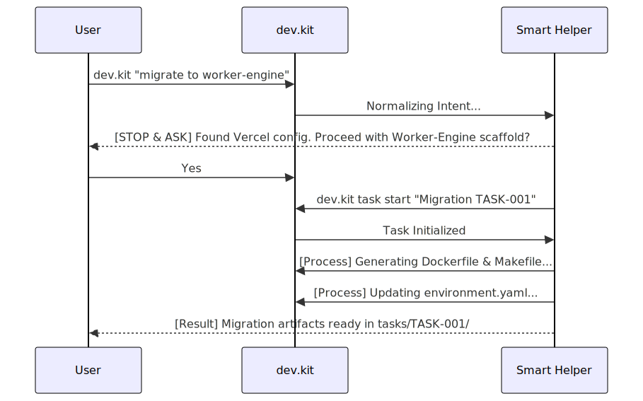

# Demo Flow: Vercel to Worker-Engine Migration

This scenario demonstrates the high-fidelity engineering lifecycle when migrating a deployment target.

**Loop**: `migration`
**Intent**: "migrate to worker-engine deployment, currently it's deployed as js on vercel"

## 🌊 The Waterfall Process



## 🛠️ Execution Steps

### 1. One-Shot Intent
Simply tell `dev.kit` what you want to achieve.
```bash
dev.kit "migrate to worker-engine deployment, currently it's deployed as js on vercel"
```

### 2. Interactive Normalization
The AI agent will detect your current environment (Vercel) and the target (`worker-engine`). It will pause to confirm the strategy.

### 3. Task Resolution
The system will:
- Initialize a tracked task.
- Audit the repository for Vercel-specific dependencies.
- Generate the necessary `worker-engine` deployment artifacts.
- Update the repository's `environment.yaml` for the new target.

### 4. Verification & Sync
```bash
dev.kit doctor
dev.kit "Resolve drift for migration task"
```

---
_UDX DevSecOps Team_
