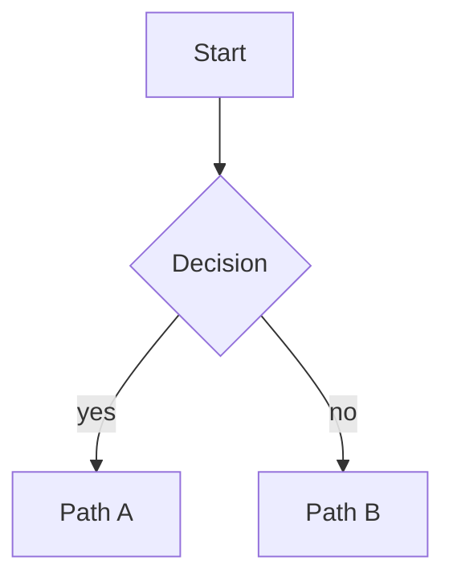
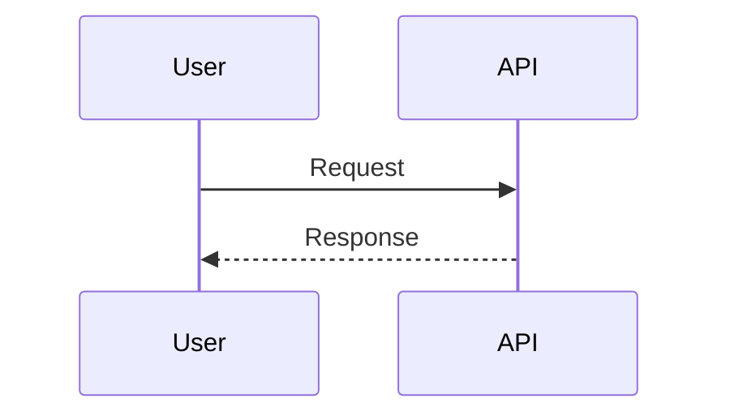
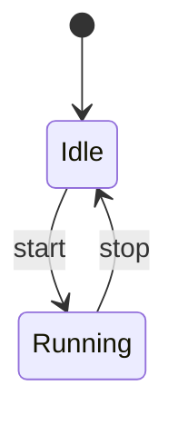
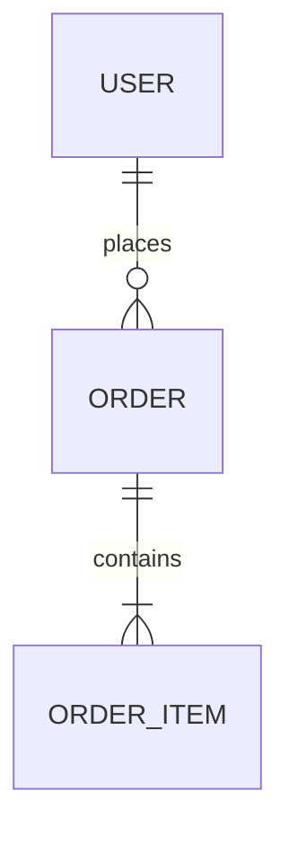

# Mermaid Patterns

Use this reference only when type selection or syntax is uncertain.

## Type Selection
- `flowchart`: Process steps, service interactions, decisions.
- `sequenceDiagram`: Time-ordered interactions between actors.
- `stateDiagram-v2`: State transitions with explicit events.
- `erDiagram`: Entity relationships and cardinality.

## Minimal Starters

### Flowchart

### Sequence

### State

### ER

## Conventions
- Keep identifiers stable during revisions.
- Prefer short node labels; move details to edge labels.
- Split diagrams when crossing domains (e.g., API flow vs deployment flow).

## SVG Export Notes
- If `mmdc` is installed but fails to launch Chromium in restricted environments, use a Puppeteer config file with args:
  - `--no-sandbox`
  - `--disable-setuid-sandbox`
- Return Mermaid output even when SVG export fails.
