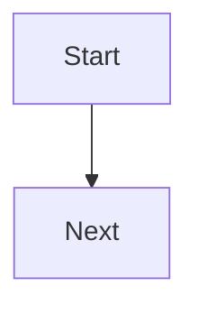

# Templates

## 2026-01-29

- Article diagram placeholder pattern:

```markdown
/<diagram>.svg" alt="Diagram description" />

<details>
<summary>Mermaid source</summary>


</details>
```

## 2026-01-29

- Research index JSON shape:

```json
{
  "schemaVersion": 1,
  "generatedAt": "2026-01-29T00:00:00Z",
  "items": [
    {
      "title": "AI and Complex Problems: A Practical View",
      "path": "research/ai-complex/index.html",
      "url": "/research/ai-complex/"
    }
  ]
}
```

## 2026-01-29

No new notes.
